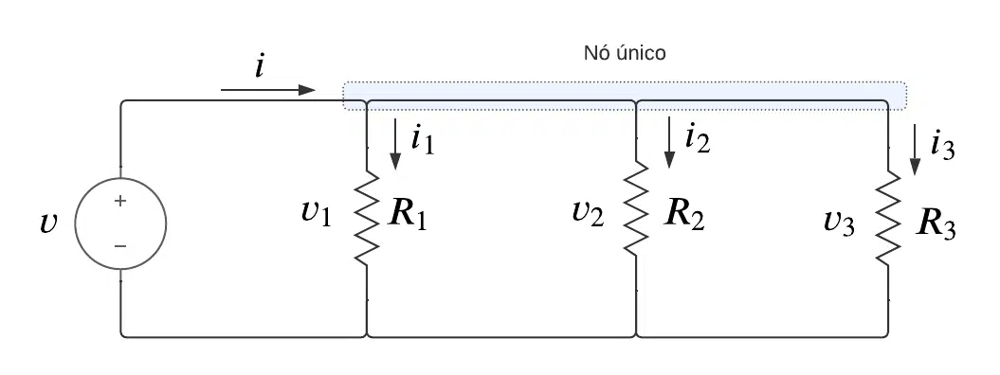

# Análise de Circuitos Elétricos
## Aula 02 - Resistência em Série, Resistência em Paralelo, Divisores de Tensão e Divisores de Corrente
 
Prof. M.Sc. Diego Ascânio Santos (ascanio@cefetmg.br)

Aula baseada sobre o material do professor Dr. Emerson Gonçalves de Melo (emerdemelo@usp.br - DEMAR EEL USP) e da Khan Academy.

Divinópolis, 2023.

---

# Roteiro

1. Revisão Lei de Ohm
2. Resistência Equivalente
3. Resistência Equivalente Para Resistores em Série
4. Resistência Equivalente Para Resistores em Paralelo
5. Simplificação de Redes de Resistores
6. Divisão da Tensão
7. Divisão da Corrente
8. Lista 2

---

Revisão - Lei de Ohm

- Da definição de $J$ é obtida a lei de Ohm

Parâmetros distribuídos:

$$
J = \sigma E \rightarrow E = {J \over \sigma} \text{ ou } E = \rho J
$$

Parâmetros concentrados:

$$
I = GV \rightarrow V = {I \over G} \text{ ou } V = RI
$$

Lei de Ohm:

$$
V = RI \text{ ou } I = {V \over R} \text{ ou } R = {V \over I}
$$

Essas relações entre Tensão, Corrente, Resistência e Condutividade Elétrica são fundamentais para o entendimento da aula de hoje e de todas as outras!

    

        
    

---

    Equivalência de Resistências

- Em muitos circuitos, a norma é que existam vários resistores;
- Frequentemente é necessário saber a resistência total do circuito:
    - Causada por todos os resistores;
- Ou a parcial:
    - Restrita a apenas segmentos dos circuitos;
- Existem resistências em série, paralelas e mistas;
- A resistência total (ou parcial) — equivalente — é determinada pela CONTRIBUIÇÃO DE TODOS OS RESISTORES do circuito (ou do segmento).

    

        
    

---

    Equivalência de Resistências - Resistores em Série

- Quando existem $n$ resistores em série, a resistência equivalente é a soma das resistências de cada um dos resistores:
    - $R_{eq} = \sum_{i = 1}^{n}{R_{i}}$
- Em resistores em série, a corrente $i$ é igual em todas as resistências.
    - Porquê a carga elétrica não pode se acumular em um resistor, sempre fluindo do ponto de maior potencial elétrico para o ponto de menor potencial.
- Pela lei de Ohm, $V = RI$. Como a corrente é igual em todos os resistores, logo, a diferença de potencial em cada resistor é dada por;
    - $V_{i} = R_{i} I; \text{ } \forall i = {1, \cdots, n}$
- Cada resistor $i$, por ser um elemento de oposição ao fluxo da carga elétrica, faz com que a diferença de potencial diminua em $R_{i}I$ na sua saída.

    

        
    

---

    Equivalência de Resistências - Resistores em Paralelo 

- Em resistores paralelos, a tensão $V$ que chega aos resistores é igual em todas as resistências.
    - Porquê o mesmo potencial elétrico se aplica a todos os resistores ao mesmo tempo.
- Considerando que a tensão $V$ em todos os resistores é igual, mas, seus valores de resistência são distintos, pela lei de Ohm, a corrente $i_{1}$ que passa pelo resistor $R_{1}$, quando multiplicada por $R_{1}$ é: $R_{1}i_{1} = V$. Entretanto, isto equivale para todas as outras resistências:
    - $R_{1}i_{1} = \cdots = R_{n}i_{n} = V$
- Como $V$ é constante e os valores de $R_{1}, \cdots, R_{n}$ sao variáveis, logo, os valores $i_{1}, \cdots, i_{n}$ também devem ser variáveis.
- Temos uma fonte variável de corrente que fornece uma corrente $I_{S}$ para o sistema.
    - Pela conservação da energia, sabemos que a soma das correntes $i_{1}, \cdots, i_{n}$ tem que ser igual a corrente total $I_{S}$:
        - $(\sum_{j = 1}^{n}{i_{j}}) = I_{S}$ 

    

        
    

---

    Equivalência de Resistências - Resistores em Paralelo 

- Pela conservação da energia, sabemos que a soma das correntes $i_{1}, \cdots, i_{n}$ tem que ser igual a corrente total $I_{S}$:
    - $(\sum_{j = 1}^{n}{i_{j}}) = I_{S}$
- Pela Lei de Ohm:
    - $R_{1}i_{1} = \cdots = R_{n}i_{n} = V$
- Logo:
    - $i_{1} = {{V} \over {R_{1}}}$; $i_{2} = {{V} \over {R_{2}}}$; $\cdots$; $i_{n} = {{V} \over {R_{n}}}$; 
- Pela Conservação da energia:
    - $(\sum_{j = 1}^{n}{i_{j}}) = I_{S} = (\sum_{j = 1}^{n}{{V} \over {R_{j}}}) = V (\sum_{j = 1}^{n}{{1} \over {R_{j}}})$
- Novamente, pela lei de Ohm:
    - $R_{\text{parallel}} = {V \over I_{S}}$
- Como $I_{S} = V (\sum_{j = 1}^{n}{{1} \over {R_{j}}})$, logo:
    - $R_{\text{parallel}} = {{V} \over {V \sum_{j = 1}^{n} {{{1} \over {R_{j}}}}}} =  {{1} \over {\sum_{j = 1}^{n} {{{1} \over {R_{j}}}}}}$
$$
\therefore {1 \over R_{\text{parallel}}} = {1 \over {R_{1}}} + \cdots + {1 \over {R_{n}}} = {\sum_{i = 1}^{n} {{{1} \over {R_{i}}}}}
$$

    

        
    

---

    Equivalência de Resistências - Exercícios Resolvidos

1. (FEI-SP) Qual a Resistência equivalente da associação a seguir?

    

        
    

    - a) $80 \Omega$ b) $100 \Omega$ c) $90 \Omega$ d) $62 \Omega$ e) $84 \Omega$ 

Resolvendo os resistores em paralelo:

$$
\begin{align}
{1 \over {R_{eq}}} &= {1 \over 20} + {1 \over 30} \rightarrow \\
{1 \over {R_{eq}}} &= {30 \over 600} + {20 \over 600} \rightarrow \\
50 R_{eq} &= 600 \rightarrow \\
R_{eq} &= 12 \Omega
\end{align}

$$

Agora que temos a resistência paralela equivalente, devemos calcular a resistência paralela em série, que é:

$$ R_{eq} = 12 \Omega + 50 \Omega = 62 \Omega $$

Sendo a resposta correta, letra d)

2. (F.M. Itajubá-MG) Abaixo temos esquematizada uma associação de resistências. Qual é o valor da resistência equivalente entre os pontos A e B?

    

---

    Equivalência de Resistências - Exercícios Resolvidos

- Para facilitar a resolução, é melhor redesenhar o circuito de outra forma:

    

- Assim, temos três resistências em série de $1 \Omega, 3 \Omega, 6 \Omega$ em paralelo com uma de $2.5 \Omega$. A resistência equivalente destas resistências também está em série com outras resistências de $1 \Omega$ e $0.5 \Omega$.

- Resolvendo: $R = [0.5 + ({1 \over {{1 \over 2.5} + {1 \over {1 + 3 + 6}}}}) + 1] \Omega \rightarrow R = 3.5 \Omega$

---

<!-- _class: lead -->
# Simplificação de Redes de Resistores

---

    Simplificando Redes de Resistores

- Existem redes de resistores complicadas, como a da imagem abaixo:

- Diante disso, qual a melhor estratégia para extrair a resistência equivalente deste circuito?

## Estratégia de Simplificação de Redes de Resistores

1. Comece o mais longe possível da fonte do circuito em questão.
2. Substitua resistores em série ou em paralelo por sua resistência equivalente.
3. Continue movendo-se à esquerda até que um único resistor equivalente represente a rede inteira de resistores.

- Faremos a simplificação deste circuito no quadro. No slide a seguir existe um vídeo da Khan Academy explicando o procedimento.

---

    <video width=100% height=100% controls>
        <source src="./videos/simplificando_resistores.mp4" type="video/mp4">
    </video>

[Simplificando redes de resistores](https://pt.khanacademy.org/science/electrical-engineering/ee-circuit-analysis-topic/ee-resistor-circuits/v/ee-simplifying-resistor-networks) por [Khan Academy](https://pt.khanacademy.org/) licenciado sob [CC BY-NC-SA 3.0](https://creativecommons.org/licenses/by-nc-sa/3.0/)

---

<!-- _class: lead -->
# Transformação $\Delta - Y | Y - \Delta$

<!-- Pessoal, antes de mais nada, vamos direto ao ponto de interesse para facilitar nosso entendimento. -->

<!-- Porque usamos transformações Delta Y, Y Delta, para que elas existem? Para podermos simplificar circuitos e calcular suas resistências equivalentes! Por isso as usamos, pois, como veremos, existem casos onde não conseguimos determinar quem está em série e quem está em paralelo -->

---

Transformação $\Delta - Y | Y - \Delta$

- Técnicas de simplificação nem sempre conseguem calcular resistência equivalente:

    

- Quantos resistores estão em paralelo? Quantos estão em série? Como calcular a resistência equivalente deste circuito?
    - Através da transformação $\Delta - Y$ (Delta - Y).

<!-- _class: lead -->
## $\Delta - Y$

- Delta e Ípsilon vêm do formato do esquema, que lembra essas letras:

    

- Permite trocar três resistores num formato $\Delta$ por outros três num formato $Y$ (e vice-versa).

---

Transformação $\Delta - Y | Y - \Delta$

- Permite trocar três resistores num formato $\Delta$ por outros três num formato $Y$ (e vice-versa).
    - Isso é útil para transformar a disposição dos resistores e poder determinar com clareza quem está em série e quem está em paralelo.
        - O que antes não era simplificável, agora se torna!

- Circuito do exemplo após passar por uma transformação $\Delta - Y$:

    

        

            
        

    

    

        

            
        

    

Agora é possível calcular sua resistência equivalente!

---

Transformação $\Delta - Y | Y - \Delta$

- Permite trocar três resistores num formato $\Delta$ por outros três num formato $Y$ (e vice-versa).
- Aplicável apenas a configurações com três terminais.
- Deve-se observar que as duas configurações possuem um número diferente de nós:
    - $\Delta$ possui três nós.
    - $Y$ possui quatro (com um nó no centro).

    

---

Transformação $\Delta - Y | Y - \Delta$

Para ocorrer a transformação, a resistência entre cada par de terminais deve ser igual, antes e depois.

    

Considerando os terminais $x$ e $y$ (e que $z$ não está conectado a nada):
- Na configuração $\Delta$ a resistência entre $x$ e $y$ é dada por:
    - $R_{xy} = {{{1} \over {{{1} \over {R_{c}}} + {{1} \over {R_{a} + R_{b}}}}}} = {{R_{c} (R_{a} + R_{b})} \over {R_{a} + R_{b} + R_{c}}}$
- Na configuração $Y$ a resistência entre $x$ e $y$ é dada por:
    - $R_{xy} = R_{1} + R_{2}$
- Logo:

$$
R_{xy} = {{{1} \over {{{1} \over {R_{c}}} + {{1} \over {R_{a} + R_{b}}}}}} = {{R_{c} (R_{a} + R_{b})} \over {R_{a} + R_{b} + R_{c}}} = R_{1} + R_{2}
$$

---

Transformação $\Delta - Y | Y - \Delta$

Aplicando os mesmos princípios para todos os terminais:

$$
\begin{align}
R_{xy} &= {{{1} \over {{{1} \over {R_{c}}} + {{1} \over {R_{a} + R_{b}}}}}} = {{R_{c} (R_{a} + R_{b})} \over {R_{a} + R_{b} + R_{c}}} = R_{1} + R_{2} \\
R_{xz} &= {{{1} \over {{{1} \over {R_{b}}} + {{1} \over {R_{a} + R_{c}}}}}} = {{R_{b} (R_{a} + R_{c})} \over {R_{a} + R_{b} + R_{c}}} = R_{1} + R_{3} \\
R_{yz} &= {{{1} \over {{{1} \over {R_{a}}} + {{1} \over {R_{b} + R_{c}}}}}} = {{R_{a} (R_{b} + R_{c})} \over {R_{a} + R_{b} + R_{c}}} = R_{2} + R_{3}
\end{align}
$$

---

Transformação $\Delta \rightarrow Y$

Aplicando manipulações algébricas nas equações anteriores, que vocês deverão desenvolver, temos na transformação $\Delta \rightarrow Y$ as seguintes equivalências entre resistências:

$$
\begin{align}
R_{1} &= {{R_{b}R_{c}} \over {R_{a} + R_{b} + R_{c}}} \\
R_{2} &= {{R_{a}R_{c}} \over {R_{a} + R_{b} + R_{c}}} \\
R_{3} &= {{R_{a}R_{b}} \over {R_{a} + R_{b} + R_{c}}} 
\end{align}
$$

E ao transformar $\Delta$ para $Y$, se introduz um nó adicional ao circuito.

---

Transformação $Y \rightarrow \Delta$

Continuando as manipulações algébricas nas equações anteriores, que vocês deverão desenvolver, temos na transformação $Y \rightarrow \Delta$ as seguintes equivalências entre resistências:

$$
\begin{align}
R_{a} &= {{R_{1}R_{2} + R_{2}R_{3} + R_{3}R_{1}} \over {R_{1}}} \\
R_{b} &= {{R_{1}R_{2} + R_{2}R_{3} + R_{3}R_{1}} \over {R_{2}}} \\
R_{c} &= {{R_{1}R_{2} + R_{2}R_{3} + R_{3}R_{1}} \over {R_{3}}}
\end{align}
$$

E ao transformar $Y$ para $\Delta$, se remove um nó do circuito.

---

Resolução do Exemplo por $\Delta \rightarrow Y$

- Não existem resistores em série ou paralelo:

    

- Redesenhando o circuito vemos que temos duas conexões $\Delta$ empilhadas uma sobre a outra:

    

- Ao fazermos uma transformação $\Delta \rightarrow Y$, adicionamos um nó ao circuito. Será que isso ordena os resistores de modo que seja possível determinar quem está em série e quem está em paralelo?

---

Resolução do Exemplo por $\Delta \rightarrow Y$

- Escolhemos arbitrariamente o $\Delta$ inferior:

    

- Ao fazer $\Delta \rightarrow Y$ no $\Delta$ inferior, os resistores pretos do $\Delta$ são substituídos pelos cinzas da configuração $Y$:

<table class="transparent-table-tr-td-th">
<tr class="transparent-table-tr-td-th">

<td class="transparent-table-tr-td-th">

    

</td>
<td class="transparent-table-tr-td-th">

    

</td>

</tr>
</table>

---

Resolução do Exemplo por $\Delta \rightarrow Y$

<table class="transparent-table-tr-td-th">
<tr class="transparent-table-tr-td-th">

<td class="transparent-table-tr-td-th">

    

</td>
<td class="transparent-table-tr-td-th">

    

</td>

</tr>
</table>

- Aplicando as equações de $\Delta \rightarrow Y$ temos:

$$
\begin{align}
R_{1} &= {{R_{b}R_{c}} \over {R_{a} + R_{b} + R_{c}}} = {{3 \times 5} \over {12}} = 1.25 \Omega \\
R_{2} &= {{R_{a}R_{c}} \over {R_{a} + R_{b} + R_{c}}} = {{4 \times 3} \over {12}} = 1 \Omega \\
R_{3} &= {{R_{a}R_{b}} \over {R_{a} + R_{b} + R_{c}}} = {{4 \times 5} \over {12}} = {5 \over 3} \Omega
\end{align}
$$

---

Resolução do Exemplo por $\Delta \rightarrow Y$

Substituindo o circuito $\Delta$ pelo seu $Y$ equivalente:

    

Agora que conseguimos distinguir quais resistores estão em paralelo e quais resistores estão em série, o circuito pode ser simplificado para calcular a resistência equivalente. 

---

Resolução do Exemplo por $\Delta \rightarrow Y$

Somando os resistores do ramo esquerdo e do ramo direito temos:

<table class="transparent-table-tr-td-th">
<tr class="transparent-table-tr-td-th">

<td class="transparent-table-tr-td-th">

    

</td>
<td class="transparent-table-tr-td-th">

    

</td>

</tr>
</table>

Calculando a resistência equivalente dos resistores paralelos: ${{1} \over {{1 \over 4.375} + {1 \over 5}}} = {7 \over 3} \Omega$

Somando com a resistência de ${5 \over 3} \Omega$ em série: ${7 \over 3} + {5 \over 3} = {12 \over 3} = 4 \Omega$.

Portanto, a resistência equivalente do segmento de circuito é de $4 \Omega$.

---

<!-- _class: lead -->
# Divisão da Tensão

---

    
Divisão da Tensão

Tecnologias distintas de circuitos integrados (CIs) - TTL e CMOS - trabalham em níveis de tensão diferentes. Os circuitos construídos sobre a tecnologia TTL trabalham com níveis de tensão de 0V até +5V. Já os construídos com CMOS trabalham com níveis de tensão entre 0V e +3.3V.

Não obstante serem tecnologias distintas, frequentemente é necessário que CIs TTL e CMOS trabalhem juntos.

É conhecido que a presença de sobretensão (Tensões acima de +3.3V) em circuitos CMOS pode danificá-los.

Assim, considerando que em muitas situações circuitos TTL e CMOS precisam interagir, como mitigar a sobretensão causada pela tensão superior dos circuitos TTL?

Por meio da sua diminuição! Se houver uma forma de diminuir 5V para 3.3V os circuitos CMOS ficam protegidos contra eventuais danos de sobretensão.

Como diminuir esta tensão? Através da **Divisão da Tensão**!

---

Divisão da Tensão

- Em resistores em série, a corrente $i$ é igual em todas as resistências porquê a carga elétrica não pode se acumular em um resistor, sempre fluindo do ponto de maior potencial elétrico para o ponto de menor potencial. Portanto, $V_{Rk} = R_{k} \cdot i$

    

- Pela conservação da energia, sabemos que: $V_{s} = V_{R1} + V_{R2} + V_{R3}$
    - Isso se generaliza na Lei de Kirchoff da Tensão que declara que a soma das tensões de todos os elementos de um circuito tem de ser nula: $\sum_{i = 1}^{n}{v_{n}} = 0$.

- Se $V_{S} = 5V$ e $i = 0.25 A$, logo, $5V - 0.25 R_{1} = 3.3V \rightarrow R_{1} = 6.8\Omega$, uma resistência de $6.8 \Omega$ em um circuito com uma corrente de 0.25A provocaria um decaimento de tensão de $1.7V$ suficiente para abaixar a tensão de $5V$ para $3.3V$ após $R_{1}$.

- Porém, nem sempre conhecemos os valores de corrente, as fontes de tensão não necessariamente mantém valores estáveis para corrente, desta forma, precisamos de outros artifícios matemáticos para calcularmos de maneira independente da corrente as tensões $V_{k}$ existentes em cada resistor $R_{k}$.

---

Divisão da Tensão

    

- A corrente $i$ é igual em todo o circuito.
- Pela lei de Ohm, $V_{S} = R_{eq} i$ que implica dizer que:

$$ 
\begin{align}
V_{S} &= R_{1} i + R_{2} i + R_{3} i \rightarrow V_{S} = i (R_{1} + R_{2} + R_{3}) \\
i &= {{V_{S}} \over {R_{1} + R_{2} + R_{3}}}
\end{align}
$$

- Sabemos que a tensão $V_{k}$ em qualquer $R_{k}$ é dada por $V_{k} = R_{K} \cdot i$.
- Substituindo $i$ nessa equação temos:
    - $V_{k} = {R_{k} \over {R_{1} + R_{2} + R_{3}}} \cdot V_{S}$

- Assim, alcançamos a forma geral do princípio da divisão de tensão que elucida que em um circuito com $N$ resistências em série, a tensão $k$ entre os terminais de um resistor $k$ qualquer é dada por:

$$V_{k} = {R_{k} \over {R_{1} + R_{2} + \cdots + R_{N}}} \cdot V_{S}$$

---

Divisão da Tensão

Retomando nosso exemplo para mitigar a sobretensão de +5V oriundas de CIs TTL na interação com CIs CMOS.

- Queremos criar uma configuração resistiva que em um resistor, preferencialmente o primeiro resistor do circuito $R_{1}$, a tensão diminua 1.7V, passando de +5V para +3.3V.
    - Pois, $5V = 1.7V + 3.3V$

    

- O princípio da divisão da tensão é nosso melhor amigo na tarefa.
    - Pois, independentemente da corrente, com apenas dois resistores, conseguimos fazer com que a tensão $V_{1}$ nos terminais do resistor $R_{1}$ seja de 1.7V, abaixando assim, a tensão de +5V para +3.3V.
    - Com apenas dois resistores é possível fazer com que $V_{1}$ seja $+1.7V$.
    - Considerando que $V_{1} = {R_{1} \over {R_{1} + R_{2}}} \cdot 5V = 1.7V$ então, ${R_{1} \over {R_{1} + R_{2}}} = {1.7 \over 5}$

---

Divisão da Tensão

    

- Queremos criar uma configuração resistiva em que um resistor, preferencialmente o primeiro resistor do circuito $R_{1}$, a tensão diminua 1.7V, passando de +5V para +3.3V.
    - Pois, $5V = 1.7V + 3.3V$

- Considerando que $V_{1} = {R_{1} \over {R_{1} + R_{2}}} \cdot 5V = 1.7V$ então, ${R_{1} \over {R_{1} + R_{2}}} = {1.7 \over 5}$
- Definindo $R_{1} = 10 k\Omega$, logo:

$$
\begin{align}
5 \times 10 k\Omega &= 1.7 \times (10 k\Omega + R_{2}) \rightarrow \\
R_{2} &= {33 \over 1.7} k\Omega \rightarrow \\
R_{2} &\simeq 19.4 k\Omega
\end{align}
$$

---

<!-- _class: lead -->
# Aplicação do Divisor de Tensão

---

    

        
    

---

<!-- _class: lead -->
# Divisão da Corrente

---

A Importância da Divisão de Correntes

As tomadas em nossas casas são conectadas a fios que possuem um limite físico do máximo de corrente que pode fluir neles. Normalmente, estes fios suportam até $10A$ de corrente. Dentro desse limite, estes condutores funcionam bem, mas imagine aparelhos que fazem $12A$ fluir por estes fios, uma corrente que excede o limite operacional dos condutores. Essa corrente excedente, chamada sobrecarga, pode superaquecer e derreter o revestimento dos fios, levando a curtos-circuitos ou até incêndios.

Agora, em circuitos elétricos, frequentemente temos várias cargas ou componentes ligados de forma que a corrente se divide entre eles. Para garantir que cada componente ou caminho do circuito receba uma quantidade segura de corrente, precisamos entender exatamente como essa divisão ocorre. É aqui que entra o princípio da divisão de correntes.

Com a habilidade de calcular a divisão de correntes, podemos assegurar que os circuitos operem de maneira segura pelo correto balanceamento de cargas para prevnir a ocorrência de sobrecargas e consequentemente, curtos-circuitos e/ou incêndios.

---

Divisão da Corrente - Lei de Kirchoff Para Corrente

Para estudarmos a divisão da corrente, facilita nosso entendimento elucidarmos um princípio a ser amplamente desenvolvido nas próximas aulas: A lei de Kirchoff para Corrente (LKC).

Esta lei preconiza que a soma das correntes que entra em um nó de um circuito tem de ser igual a soma das correntes que saem dele. Considerando o nó abaixo, temos as correntes $i_{1}, i_{3} \text{ e } i_{4}$ entrando no nó, enquanto as correntes $i_{2} \text{ e } i_{5}$ saem dele.

    

Assim,

$$
i_{1} + i_{3} + i_{4} = i_{2} + i_{5}
$$

---

Divisão da Corrente - Lei de Kirchoff Para Corrente

Para qualquer nó pertencente a um circuito, a LKC pode ser generalizada para as $N$ correntes que convergem nele na forma:

$$
\sum_{k = 1}^{N}{i_{k}} = 0
$$

Como a corrente é uma variável em função do diferencial da carga e do tempo, logo, a LKC também estabelece que as cargas que entram em um nó são iguais às que saem dele:

$$
\begin{align}
i_{\text{entrada}} &= i_{\text{saida}} \\
\int {i_{\text{entrada}}(t) dt} &= \int {i_{\text{saida}}(t) dt} \\
Q_{\text{entrada}} &= Q_{\text{saida}}
\end{align}
$$

---

Divisão da Corrente

Considere o circuito abaixo:

    

Temos uma corrente $i$ entrando no nó único e três correntes $i_{1}, i_{2} \text{ e } i_{3}$ saindo dele. Uma vez que o circuito possui resistores em paralelo e a corrente se divide ao passar pelo nó único que conecta eles, é preciso lembrar que a corrente sempre busca o caminho de menor resistência (ou de maior condutividade). É essencial considerar este fato para avaliar se os valores de corrente a serem calculados fazem sentido.

Continuando a avaliação do circuito, pelos três resistores em paralelo, temos que a resistência equivalente do circuito é dada por:

$$
R_{eq} = {{1} \over {{1 \over R_{1}} + {1 \over R_{2}} + {1 \over R_{2}}}} = G_{eq}^{-1}
$$

Pela Lei de Ohm, sabemos que $v = R_{eq} i$, o que implica em dizer que $i = {v \over R_{eq}} \rightarrow i = v G_{eq}$.

Como os três resitores estão em paralelo, logo a tensão entre os terminais deles é igual. Assim:

$i_{1}R_{1} = i_{2}R_{2} = i_{3}R_{3} = i R_{eq}$

---

Divisão da Corrente

    

$i_{1}R_{1} = i_{2}R_{2} = i_{3}R_{3} = i R_{eq}$

Portanto, com as devidas manipulações algébricas, a corrente $k$ que passa qualquer ramo de um circuito com resistores em paralelo é igual à resistência equivalente do circuito em paralelo, dividido pela resistência do resistor de interesse $k$ (aquele que planejamos encontrar a corrente) e multiplicada pela corrente total que entra na configuração em paralelo. Logo:

$$

i_{k} = {R_{eq} \over R_{k}} \cdot i

$$

Considerando em função das condutâncias, ${1 \over R_{k}} = G_{k}$ e $R_{eq} = G_{eq}^{-1}$, logo: $i_{k} = G_{eq}^{-1} \cdot G_{k} \cdot i$.

Como $G_{eq} = G_{1} + G_{2} + \cdots + G_{n}$. Assim:

$$
\begin{align}
i_{k} = {G_{k} \over {G_{1} + G_{2} + \cdots + G_{n}}} \cdot i \therefore \\
\text{Principio da Divisao da Corrente}
\end{align}
$$

Que implica que a corrente se distribui de maneira proporcional às condutâncias, atingindo maiores valores nos ramos de maior condutância (e menor resistividade).

---

<!-- _class: lead -->
## Exemplo - Divisão de Correntes

1. Em um terminal elétrico estão ligados em paralelo: Um microcomputador com uma fonte de $440W$, um aparelho de som cuja resistência equivalente é de $220 \Omega$ e um monitor LCD de 24 polegadas que consome $1.5 A$. Sabendo que a tensão de operação de todos os equipamentos é de $110V$ e considerando que a capacidade máxima de corrente do terminal é de 10A, que sobre este terminal é aplicada uma tensão de 110V (tensão residencial) e que existe um dispositivo de proteção (fusível) acoplado a este terminal, que desarma na ocorrência de correntes superiores à $10A$, é possível ligar um segundo monitor LCD em paralelo a este terminal?

2. Para o circuito do exercício anterior:

- Desenhe o diagrama que o representa com cada um de seus elementos identificados;
- Calcule para cada um dos elementos do circuito:
	- A resistência que possui;
	- A corrente que passa através de si;
	- A tensão a que está submetido;
	- A potência elétrica que consome.
- Por fim, calcule a resistência equivalente do circuito, sua corrente, sua tensão e sua potência total.

---

Exemplo - Divisão de Correntes

Começamos a resolver o exemplo a partir do exercício 2 e desenhamos inicialmente o diagrama do circuito para viabilizar nossa resolução:

    

Sabemos que todos os equipamentos trabalham na tensão de $110V$ e por estarem em paralelo, possuem esta mesma tensão em suas entradas.

Agora, sabemos a corrente do monitor $i_{3} = 1.5A$, devemos calcular as correntes do computador e do som.

Começando pelo som, pela lei de Ohm, temos que $I = {V \over R}$. Considerando que a tensão é de $110V$ e a resistência do aparelho de som é de $220 \Omega$, logo, $i_{2} = {110 \over 220} = 0.5 A$. Conseguimos também calcular sua potência $P = 110 \times 0.5 = 55W$.

Avançando para o computador, sabemos da potência elétrica que $P = VI$. Considerando que $V = 110V$ e $P = 440W$, logo, $i_{1} = {440 \over 110} = 4A$.

Sabemos pela LKC que $I = i_{1} + i_{2} + i_{3}$. Então, $I = 4 + 0.5 + 1.5 = 6A$.

Considerando que mais um monitor em paralelo acrescentaria uma carga de $+1.5A$, que a carga total com este monitor seria de $7.5 < 10A$, logo, é possível adicionar mais um monitor a esta configuração.

---

Exemplo - Divisão de Correntes

    

Continuando a resolução, cientes das correntes $i_{1}, i_{2}, i_{3}$, serão calculados as outras grandezas solicitadas no exercício. Para calcular a resistência $R_{1}$ do computador, podem ser utilizadas duas fórmulas: $R = {V \over I}$ ou $R = {P \over I^{2}}$.

$$
\begin{align}
R_{1} = {110 \over 4} = {440 \over 16} = 27.5 \Omega
\end{align}
$$

Considerando que o Monitor possui uma corrente de $1.5A$ e uma tensão de $110V$, logo:

$$
R_{3} = {110 \over 1.5} = {220 \over 3} \Omega
$$

E sua potência é de $165W$

Sabe-se que a corrente $i$ do circuito é de $6A$. A resistência equivalente do circuito é dada por ${110 \over 6} = {220 \over 12} \Omega$ e sua potência total é de $110 \times 6 = 660 W$

Conferindo a resistência equivalente do circuito pela equação:

$$
\begin{align}
R_{eq} &= {{1} \over {{{1} \over {27.5}} + {{1} \over {220}} +{{1} \over {{{220} \over {3}}}}}} \\
R_{eq} &= {{1} \over {{{8} \over {220}} + {{1} \over {220}} + {{3} \over {220}}}} \\
R_{eq} &= {220 \over 12} \Omega
\end{align}
$$

---

    Exercícios - Lista 2 (Entrega em 15/08/2023)

- Problemas do capítulo 2 do livro Circuitos Elétricos 10ª Edição (Riedel e Nillson): 2.18, 2.19, 2.20, 2.21, 2.22.
- Problemas do capítulo 3 do livro Circuitos Elétricos 10ª Edição (Riedel e Nillson): 3.3, 3.4, 3.6, 3.7, 3.8, 3.9, 3.12, 3.13, 3.16, 3.18, 3.30.

Livro: ISBN 978-85-4301-812-6

---

Gabarito da Lista

- 2.18:
    - a) $i_{a} = 2A, i_{b} = 0.5A, i_{g} = 2.5A$
    - b) $i_{b} = 0.5A$
    - c) $v_{0} = 40V$
- 2.19:
    - a) $i_{1} = 1.2A, i_{2} = 0.3A$
    - b) $v_{0} = v_{1} = 120V$
    - c) $\sum{P_{\text{dev}}} = 180W \text{ } \sum{P_{\text{abs}}} = 144 + 13.5 + 22.5 = 180W$
- 2.20:
    - a) $i_{a} = {3.5 \over 175} = 0.02 A$ (Lei de Ohm); $i_{1} = i_{a} = 0.02A$
    - b) $v_{b} = 200 i_{1} = 200(0.02) = 4V$ (Lei de Ohm); 
      $-v_{1} + v_{b} + 3.5 = 0 \rightarrow v_{1} = 3.5 + v_{b} = 3.5 + 4 = 7.5V$

- 2.20:
    - c) $v_{a} = 0.05 (50) = 2.5V$ (Lei de Ohm) 
      $-v_{g} + v_{a} + v_{1} = 0 \rightarrow$
      $v_{g} = v_{a} + v_{1} = 2.5 + 7.5 = 10V$
    - d) $p_{g} = v_{g} (0.05) = 10 (0.05) = 0.5 W$
- 2.21:
    - a) $v_{0} = 16V, i_{0} = 8 mA$
    - b) $i_{g} = 10 mA$
    - c) $p_{g} = -160 mW$
- 2.22:
    - a) $v_{2} = 100V, i_{2} = 4A, i_{3} = 3A$
      $v_{1} = 130V, i_{1} = 2A, i_{4} = 5A, i_{g} = 6A$

---

Gabarito da Lista

- 3.6:
    - a) 3.4(a): $R_{\text{eq}} = 36\Omega$
         3.4(b): $R_{\text{eq}} = 60\Omega$
         3.4(c): $R_{\text{eq}} = 150 k\Omega$
         3.4(d): $R_{\text{eq}} = 3.25 k\Omega$

    - b) 3.4(a): $P = 9 W$
         3.4(b): $P = 54 mW$
         3.4(c): $P = 24 mW$
         3.4(d): $P = 1.3 W$
- 3.7:
    - a) 3.7(a) $R_{\text{eq}} = 60 \Omega$
         3.7(b) $R_{\text{eq}} = 20 \Omega$
         3.7(c) $R_{\text{eq}} = 4 k\Omega$
         3.7(d) $R_{\text{eq}} = 300\Omega$

- 3.7:
    - b) 3.7(a) $P = 15 W$
         3.7(b) $P = 128 mW$
         3.7(c) $P = 100 mW$
         3.7(d) $P = 750 mW$
- 3.8:
    - a) $R_{\text{ab}} = 72 \Omega$
    - b) $R_{\text{ab}} = 10 k\Omega$
    - c) $R_{\text{ab}} = 288 \Omega$
- 3.9:
    - a) $R_{\text{ab}} = 12 \Omega$
    - b) $R_{\text{ab}} = 30 \Omega$
    - c) $R_{\text{ab}} = 1.4 k\Omega$
    - d) $R_{\text{ab}} = 25 \Omega$

---

Gabarito da Lista

- 3.12:
    - a) $v_{0} = 66 V$
    - b) $i = 20 mA$
         $P_{R_{1}} = 1.88W$
         $P_{R_{2}} = 1.32W$
    - c) $R_{1} \geq 17672 \Omega$
         $R_{2} = 12408 \Omega$

- 3.13:
    - $R_{2} = 10 \Omega, R_{e} = {120 \over 17} \Omega, R_{L} = 24 \Omega$

- 3.16:
    - $R_{\text{eq}} = 5 \Omega, v_{10A} = v_{10\Omega} = 50 V$
      $v_{5\Omega} = 20V$
      $P_{5\Omega} = 80W$

- 3.18:
    - $i_{2} = 8.33mA, i_{1} = 5mA, i_{3} = 16.67mA, i_{4} = 20mA$
    - $R_{1} = 5k\Omega, R_{2} = 3k\Omega, R_{3} = 1.5k\Omega, R_{4} = 1.25k\Omega$

- 3.30:
    - $R_{\text{eq}} = 45 \Omega$
    - $v_{R_{\text{eq}}} = 1 V$
    - $v_{1} = {5 \over 9} V$
    - $v_{2} = {1 \over 3} V$

---

Referências Bibliográficas

- RIEDEL, SUSAN A.; NILSSON, James W. Circuitos Elétricos. 2015.
- MELO, EMERSON G. de. Curso: LOM3202 - Circuitos Elétricos (2020). 2020. Disponível em: https://edisciplinas.usp.br/course/view.php?id=82680. Acesso em 31 de Julho de 2023.
- Khan Academy. Curso de Engenharia Elétrica. Disponível em: https://pt.khanacademy.org. Acesso em 31 de Julho de 2023.

